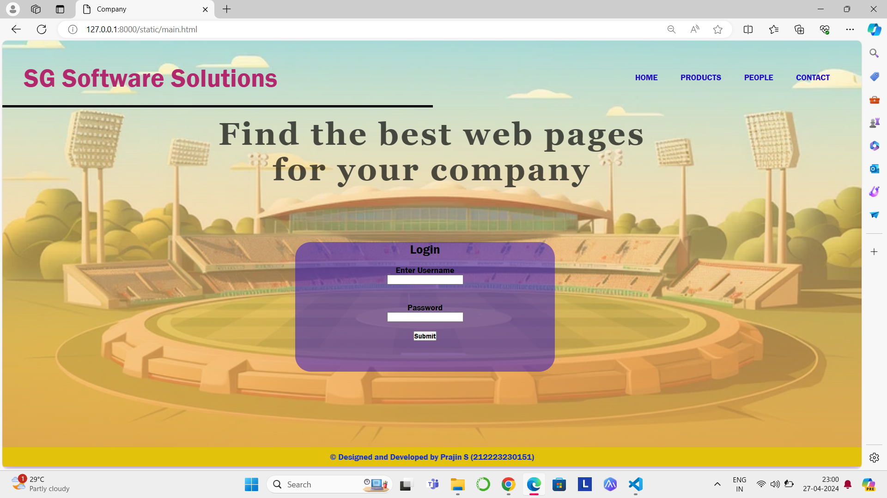

# Ex.07 Software Product Company Website
## Date: 27-04-2024

## AIM:
To develop a static company website to display the softwares and services provided by the company.

## DESIGN STEPS:

### Step 1:
Requirement collection.

### Step 2:
Creating the layout using HTML and CSS.

### Step 3:
Updating the sample content.

### Step 4:
Choose the appropriate style and color scheme.

### Step 5:
Validate the layout in various browsers.

### Step 6:
Validate the HTML code.

### Step 7:
Publish the website in the given URL.

## PROGRAM:
### home.html
```
<html>
  <head>
    <meta name="viewport" content="width=device-width, initial-scale=1.0" />
    <title>Company</title>
    <style type="text/css">
      * {
        margin: 0;
        padding: 0;
        font-family: 'Franklin Gothic Medium', 'Arial Narrow', Arial, sans-serif;
      }
      .banner {
        width: 100%;
        height: 95vh;
        background-image: linear-gradient(
            rgba(255, 255, 255, 0.2),
            rgba(241, 165, 79, 0.75)
          ),
          url(background.jpg);
        background-size: cover;
        background-position: center;
        backdrop-filter: blur(4px);
      }
      .navbar {
        width: 95%;
        margin: auto;
        padding: 25px 0;
        display: flex;
        align-items: center;
        justify-content: space-between;
      }
      .logo {
        color: #b2286d;
        font-size: 50px;
        font-weight: 700;
      }
      span {
        color: #b2286d;
      }
      form {
        width: 200px;
        height: 40px;
        display: flex;
        background: rgba(255, 255, 255, 0.2);
        padding: 1px 1px;
        font-size: 15px;
        border-radius: 10px;
        backdrop-filter: blur(4px) saturate(180%);
      }
      form input {
        background: transparent;
        flex: 1;
        border: 0;
        outline: none;
        padding: 12px 20px;
        font-size: 15px;
        color: white;
      }
      ::placeholder {
        color: white;
      }
      form button {
        border: 0;
        outline: none;
        padding: 5px 20px;
        color: white;
        border-radius: 10px;
        background: #7959B1;
        cursor: pointer;
      }
      
      .navbar li {
        list-style: none;
        display: inline-block;
        margin: 0 20px;
        position: relative;
      }
      .navbar li a {
        text-decoration: none;
        color: rgb(31, 12, 202);
        text-transform: uppercase;
      }
      
      .content {
        position: absolute;
        top: 50%;
        left: 50%;
        transform: translate(-50%, -50%);
        text-align: center;
      }
      .text h3 {
        color: rgba(0, 0, 0, 0.677);
        font-weight: 800;
        font-size: 60px;
        letter-spacing: 4px;
        font-family: 'Georgia';
      }
      .pa{
            width:500px;
            height: 250px;
            justify-content:center;
            justify-items: center;
            border-radius: 30px;
            background-color: rgba(45, 15, 196, 0.525);
            margin-left: 150px;
            margin-top: 70px;
        }
      footer {
        border: 1px;
        padding: 10px;

        transition: 0.5s;
        background: #e2c20b;
        color: #102fdf;
        box-shadow: 0 0 20px #7959B1;
      }
    </style>
  </head>
  <body>
    <div class="banner">
      <br />
      <div class="navbar">
        <h1 class="logo"><span>SG </span>Software Solutions</h1>
        <ul>
          <li><a href="main.html"> Home </a></li>
          <li><a href="pro.html"> Products </a></li>
          <li><a href="inc.html"> People </a></li>
          <li><a href="conus.html"> Contact </a></li>
        </ul>
      </div>
      <hr size="4" color="black" width="50%">
      <div class="content">
        <div class="text">
          <h3>
            Find the best web pages for your company
          </h3>
          <br />

          <br />
        </div>
        <div class="pa">
            <h2 align="center">Login</h3>
            <br>
            <div>
            <h4>Enter Username</h4><input type="text"><br><br><br>
            <h4>Password</h4>
            <input type="text"><br><br>
            </div>
            <div>
            <button >Submit</button>
            </div>
        </div>
      </div>
    </div>
    <footer>
      <center> &#169 Designed and Developed by <b>Prajin S  (212223230151)</b></center>
    </footer>
  </body>
</html>
```
### product.html
```
<!DOCTYPE html>
<html>
<head>
    <meta name="viewport" content="width=device-width, initial-scale=1.0">
    <title>Product Page</title>
    <style type="text/css">
        * {
            margin: 0;
            padding: 0;
            font-family: 'Franklin Gothic Medium', 'Arial Narrow', Arial, sans-serif;
        }
        .banner {
            width: 100%;
            height: 95vh;
            background-image: linear-gradient(
                rgba(255, 255, 255, 0.2),
            rgba(241, 165, 79, 0.75)
            ),
            url(background.jpg);
            background-size: cover;
            background-position: center;
            backdrop-filter: blur(4px);
        }
        .navbar {
            width: 95%;
            margin: auto;
            padding: 25px 0;
            display: flex;
            align-items: center;
            justify-content: space-between;
        }
        
        .logo {
            color: #b2286d;
            font-size: 50px;
            font-weight: 700;
        }
        span {
            color: #b2286d;
        }
        form {
            width: 200px;
            height: 40px;
            display: flex;
            background: rgba(255, 255, 255, 0.2);
            padding: 1px 1px;
            font-size: 15px;
            border-radius: 10px;
            backdrop-filter: blur(4px) saturate(180%);
        }
        form input {
            background: transparent;
            flex: 1;
            border: 0;
            outline: none;
            padding: 12px 20px;
            font-size: 15px;
            color: white;
        }
        ::placeholder {
            color: white;
        }
        form button {
            border: 0;
            outline: none;
            padding: 5px 20px;
            color: white;
            border-radius: 10px;
            background: #7959B1;
            cursor: pointer;
        }
        
        .navbar li {
            list-style: none;
            display: inline-block;
            margin: 0 20px;
            position: relative;
        }
        .navbar li a {
            text-decoration: none;
            color: rgb(31, 12, 202);
            text-transform: uppercase;
        }
        .text h3 {
        color: rgba(0, 0, 0, 0.677);
        font-weight: 800;
        font-size: 40px;
        letter-spacing: 4px;
        font-family: 'Georgia';
        }
        .container {
            background: transparent;
            padding: 30px 10%;
            padding-bottom: 100px;
        }
        .container .box-container {
            display: grid;
            grid-template-columns: repeat(auto-fit, minmax(170px, 1fr));
            gap: 100px;
        }
        .container .box-container .box {
            color: white;
            box-shadow: 0 5px 10px rgba(0, 0, 0, 0.2);
            background-color:  rgba(45, 15, 196, 0.525);
            padding: 40px 70px;
            text-align: center;
        }
        .container .box-container .box img {
            height: 90px;
            width: 80px;
        }
        .container .box-container .box h3 {
            color: #ffffff;
            font-family: 'Times New Roman',;
            font-size: large;
            padding: 20px 0;
        }
        .container .box-container .box p {
            color: white;
            font-size: small;
            line-height: 1.5;
        }
        footer {
            border: 1px;
            padding: 10px;
            transition: 0.5s;
            background: #e2c20b;
            color: #102fdf;
            box-shadow: 0 0 20px #7959B1;
        }
    </style>
</head>
<body>
<div class="banner">
    <br />
    <div class="navbar">
        <h1 class="logo"><span>SG </span>Software Solutions</h1>
        <ul>
            <li><a href="main.html"> Home </a></li>
            <li><a href="pro.html" class="bg-product"> Products </a></li>
            <li><a href="inc.html"> People </a></li>
            <li><a href="conus.html"> Contact </a></li>
        </ul>
    </div>
    <hr size="4" color="black" width="50%">
    <div class="text">
        <h3>
          Companies we have created web page for
        </h3>
        <br />

    </div>
    <div class="container">
        <div class="box-container">
            <div class="box">
                
                <h3>Dream 11</h3>
            </div>
            <div class="box">
                
                <h3>My 11 Circle</h3>
            </div>
            <div class="box">
                
                <h3>B.C.C.I</h3>
            </div>
            <div class="box">
                
                <h3>STAR Network</h3>
            </div>
            <div class="box">
                
                <h3>SONY Network</h3>
            </div>
        </div>
    </div>
</div>
<footer>
    <center> &#169 Designed and Developed by <b>Prajin S  (212223230151)</b></center>
</footer>
</body>
</html>
```
### people.html
```
<html>
  <head>
    <meta name="viewport" content="width=device-width, initial-scale=1.0" />
    <title>People</title>
    <style type="text/css">
      * {
        margin: 0;
        padding: 0;
        font-family: Arial, Helvetica, sans-serif;
      }
      .banner {
        width: 100%;
        height: 95vh;
        background-image: linear-gradient(
            rgba(255, 255, 255, 0.2),
            rgba(241, 165, 79, 0.75)
          ),
          url(background.jpg);
        background-size: cover;
        background-position: center;
        backdrop-filter: blur(4px);
      }
      .navbar {
        width: 95%;
        margin: auto;
        padding: 25px 0;
        display: flex;
        align-items: center;
        justify-content: space-between;
      }
      .logo {
        color: #b2286d;
        font-size: 50px;
        font-weight: 700;
      }
      span {
          color: #b2286d;
      }
      form {
        width: 200px;
        height: 40px;
        display: flex;
        background: rgba(255, 255, 255, 0.2);
        padding: 1px 1px;
        font-size: 15px;
        border-radius: 10px;
        backdrop-filter: blur(4px) saturate(180%);
      }
      form input {
        background: transparent;
        flex: 1;
        border: 0;
        outline: none;
        padding: 12px 20px;
        font-size: 15px;
        color: white;
      }
      ::placeholder {
        color: white;
      }
      form button {
          border: 0;
          outline: none;
          padding: 5px 20px;
          color: white;
          border-radius: 10px;
          background: #7959B1;
          cursor: pointer;
        }
      .navbar li {
        list-style: none;
        display: inline-block;
        margin: 0 20px;
        position: relative;
      }
      .navbar li a {
        text-decoration: none;
        color: rgb(31, 12, 202);
        text-transform: uppercase;
      }
      .image {
        position: relative;
        border: 0;
        top: 150px;
        background: transparent;
      }
      .image table {
        border: 0;
        color: rgba(46, 12, 216, 0.651);
        position: relative;
        left: 100px;
      }
      .image table img {
        height: 220px;
        width: 180px;
        border: 2px solid rgba(29, 14, 194, 0.549);
        padding: 5px;
        border-radius: 10%;
      }
      .image table td {
        color: #c02070e2;
      }
      footer {
          border: 1px;
          padding: 10px;
          transition: 0.5s;
          background: #e2c20b;
          color: #102fdf;
          box-shadow: 0 0 20px #7959B1;
        }
    </style>
  </head>
  <body>
    <div class="banner">
      <br />
      <div class="navbar">
        <h1 class="logo"><span>SG </span>Software Solutions</h1>
        <ul>
          <li><a href="main.html"> Home </a></li>
          <li><a href="pro.html"> Products </a></li>
          <li><a href="inc.html" class="bg-people"> People </a></li>
          <li><a href="conus.html"> Contact </a></li>
        </ul>
      </div>
      <hr size="4" color="black" width="50%">
      <div class="image">
        <table cellspacing="20">
          <tr align="center">
            <td></td>
            <td></td>
            <td></td>
            <td></td>
            <td></td>
            <td></td>
            <td></td>
          </tr>
          <tr align="center">
            <th>Prajin S</th>
            <th>Brendon M</th>
            <th>J Anderson</th>
            <th>G McGrath</th>
            <th>Abraham B D</th>
            <th>P Cummins</th>
            <th>Alastair C</th>
          </tr>
          <tr align="center">
            <td>FOUNDER</td>
            <td>CO-FOUNDER</td>
            <td>CEO</td>
            <td>MANAGING DIRECTOR</td>
            <td>MARKETING MANAGER</td>
            <td>HR MANAGER</td>
            <td>PRODUCT MANAGER</td>
          </tr>
        </table>
      </div>
    </div>
    <footer>
      <center> &#169 Designed and Developed by <b>Prajin S  (212223230151)</b></center>
    </footer>
  </body>
</html>
```
### contact.html
```
<!DOCTYPE html>
<html>
<head>
    <meta name="viewport" content="width=device-width, initial-scale=1.0">
    <title>Contact</title>
    <style type="text/css">
        * {
            margin: 0;
            padding: 0;
            font-family: Arial, Helvetica, sans-serif;
        }
        .banner {
            width: 100%;
            height: 95vh;
            background-image: linear-gradient(
                rgba(255, 255, 255, 0.2),
               rgba(241, 165, 79, 0.75)
            ),
            url(background.jpg);
            background-size: cover;
            background-position: center;
            backdrop-filter: blur(4px);
        }
        .navbar {
            width: 95%;
            margin: auto;
            padding: 25px 0;
            display: flex;
            align-items: center;
            justify-content: space-between;
        }
        .logo {
            color: #b2286d;
            font-size: 50px;
            font-weight: 700;
        }
        span {
            color: #b2286d;
        }
        .navbar form {
            width: 200px;
            height: 40px;
            display: flex;
            background: rgba(255, 255, 255, 0.2);
            padding: 1px 1px;
            font-size: 15px;
            border-radius: 10px;
            backdrop-filter: blur(4px) saturate(180%);
        }
        .navbar form input {
            background: transparent;
            flex: 1;
            border: 0;
            outline: none;
            padding: 12px 20px;
            font-size: 15px;
            color: white;
        }
        ::placeholder {
            color: white;
        }
        .navbar form button {
            border: 0;
            outline: none;
            padding: 5px 20px;
            color: white;
            border-radius: 10px;
            background: #7959B1;
            cursor: pointer;
        }
        .navbar li {
            list-style: none;
            display: inline-block;
            margin: 0 20px;
            position: relative;
        }
        .navbar li a {
            text-decoration: none;
            color: rgb(31, 12, 202);
            text-transform: uppercase;
        }
        .box {
            display: flex;
            column-gap: 40px;
            background: transparent;
            justify-content: center;
            position: relative;
            top: 50px;
        }
        .box-2 {
            background: rgba(255, 255, 255, 0.2);
            height: 500px;
            width: 500px;
            border-radius: 20px;
            background-color:  rgba(45, 15, 196, 0.407);
            position: relative;
        }
        .box-2 h2 {
            color: #b2286d;
            text-align: center;
            font-size: 36px;
            margin-top: 25px;
        }
        .box-2 p {
            color: #9ed70f;
            text-align: center;
            font-size: 25px;
            margin-top: 20px;
            line-height: 1.5;
        }
        .box-2 span {
            color: rgb(31, 12, 202);
            font-size: 30px;
        }
        footer {
            border: 1px;
            padding: 10px;
            transition: 0.5s;
            background: #e2c20b;
            color: #102fdf;
            box-shadow: 0 0 20px #7959B1;
        }
    </style>
</head>
<body>
<div class="banner">
    <br />
    <div class="navbar">
        <h1 class="logo"><span>SG </span>Software Solutions</h1>
        <ul>
            <li><a href="main.html"> Home </a></li>
            <li><a href="pro.html"> Products </a></li>
            <li><a href="inc.html"> People </a></li>
            <li><a href="conus.html" class="bg-contact"> Contact </a></li>
        </ul>
    </div>
    <hr size="4" color="black" width="50%">
    <div class="box">
        <div class="box-2">
            <h2>Contact Information</h2>
            <p>
                <span>Address  : </span>Ram Towers,MG Road,Statue,Thiruvananthapuram,Kerala-695001.
            </p>
            <p><span>Email  </span>: sgsportsofficial@gmail.com</p>
            <p><span>Phone  </span>: 9564123123</p>
        </div>
    </div>
</div>
<footer>
    <center> &#169 Designed and Developed by <b>Prajin S  (212223230151)</b></center>
</footer>
</body>
</html>
```

## OUTPUT:



## RESULT:
The program for designing software company website using HTML and CSS is completed successfully.
